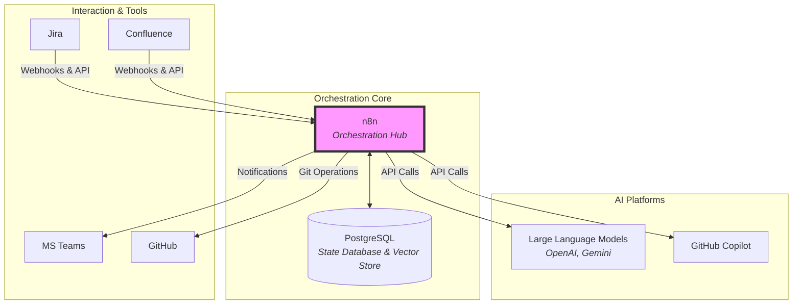
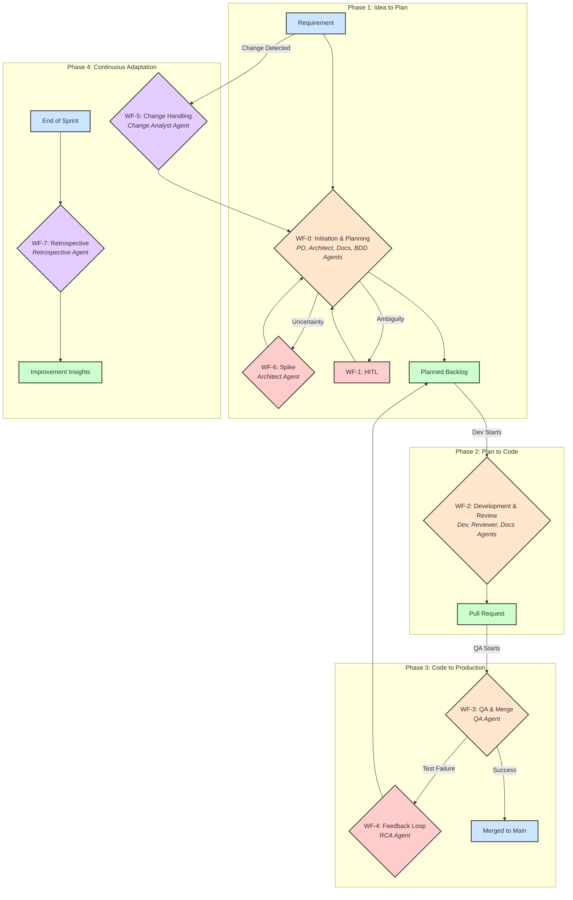

# **Enhanced Technical Design: Agile-Driven Autonomous Development Team v1.9**

## **Part 1: Executive Summary & Vision**

This document defines the architecture for the "Agile-Driven Autonomous Development Team," an AI-driven ecosystem that uses n8n as its central orchestration engine to automate the Software Development Lifecycle (SDLC).

Our vision is to create a self-learning system that embodies Agile principles, capable of supporting strategic planning, which significantly accelerates time-to-market, optimizes developer productivity, and establishes a new standard for architectural consistency and quality. This system is built upon a combination of specialized AI Agents, a flexible Human-in-the-Loop (HITL) framework, and a "Living Document" philosophy to ensure absolute synchronization between source code and documentation.

## **Part 2: Core Architecture & Guiding Principles**

### **2.1. System Architecture**

The system is built on key components that interact through the n8n orchestration hub.



### **2.2. Guiding Principles**

This design explicitly automates several core Agile and software engineering principles:

| Principle | Implementation |
| :---- | :---- |
| **Inspect and Adapt** | The **WF-7: Automated Retrospective** directly embodies this. By regularly analyzing performance and generating insights, the system provides the team with the data needed to adapt its processes for the next cycle. |
| **Waste Reduction (Muda)** | The **Retrospective Agent** is trained to identify process waste, such as excessive wait times in the "In Review" state. By flagging these bottlenecks, it helps the team streamline its value stream and improve flow efficiency. |
| **Managing Uncertainty** | The **WF-6: Investigation Spike** provides a formal, automated mechanism for tackling technical uncertainty. This prevents teams from committing to work they don't fully understand, reducing risk and improving estimates. |
| **Living Documents** | A philosophy that treats documentation (architecture, API, roadmaps) as part of the source code, stored in the same repository and updated automatically in the same Pull Request as the related code changes. |
| **Quality Gates (DoR/DoD)** | By building automated **Definition of Ready** and **Definition of Done** checks into the workflows, the system ensures that work items meet a consistent quality standard before moving between stages. |
| **Phased Automation** | A cautious deployment strategy, starting with AI in an assistive role, then moving to conditional automation, and finally to supervised autonomy. |

## **Part 3: The AI Workforce: Meet the Team**

This section provides a detailed profile of the AI specialists in our team.

* **Analysis & Planning Team:**  
  * **PO Agent:** The product visionary.  
  * **Architect Agent:** The technical planner and risk assessor.  
  * **BDD Analyst Agent:** The requirements clarifier.  
* **Development & Quality Team:**  
  * **Developer Agent:** The primary coder. **Leverages the GitHub Copilot API** to translate the "Context Package" into source code and unit tests.  
  * **Reviewer Agent:** The code quality guardian. **Leverages the GitHub Copilot API** to perform automated code reviews based on the PR diff and architectural constraints.  
  * **QA Agent:** The end-to-end tester.  
* **Support & Operations Team:**  
  * **Documentation Agent:** The technical writer and roadmap keeper.  
  * **Change Analyst Agent:** The change impact assessor.  
  * **RCA Agent (Root Cause Analysis):** The incident investigator.  
  * **Retrospective Agent:** The Agile coach.

## **Part 4: The Autonomous SDLC: A Feature's Journey**

This section describes the end-to-end journey of a feature, from initial idea to production deployment, orchestrated by the autonomous system.

### **Workflow Summary Table**

| ID | Workflow Name | Trigger | Invoked AI Agents | Input | Output |
| :---- | :---- | :---- | :---- | :---- | :---- |
| **WF-0** | Project Initiation | Manual with Req Link | PO, Architect, Docs, BDD | Requirement URL | Planned Backlog, Docs |
| **WF-1** | HITL Clarification | Called by other WFs | None | Question/Context | Human Action Required |
| **WF-2** | Development & Review | Jira Status Change | Developer, Reviewer, Docs | Jira Ticket | Pull Request |
| **WF-3** | QA & Completion | Jira Status Change | QA | Pull Request | Merged Code or Failure |
| **WF-4** | Feedback Loop | Called by WF-3 | RCA | Failure Logs | Bug-fix Task |
| **WF-5** | Change Handling | Jira/Confluence Webhook | Change Analyst | Document Change | Re-triggered Planning |
| **WF-6** | Investigation Spike | Jira Issue Creation | Architect | Spike Story | Research Report |
| **WF-7** | Automated Retrospective | Scheduled | Retrospective | Sprint Data | Retrospective Report |

### **Journey Visualization**


### **Phase 1: From Idea to Plan (WF-0, WF-1, WF-6)**

This phase transforms a high-level requirement into a fully planned, estimated, and de-risked backlog.

1. **Initiation (WF-0):** A Project Manager triggers the process with a link to a requirement in Confluence or Jira. The system assigns a unique **Trace ID** for observability.  
2. **Context Enrichment:** The system queries a **Vector DB** to find similar past requirements, architectural decisions, and relevant documentation to provide rich context to the planning agents.  
3. **Duplicate Check:** An AI agent semantically compares the new request against existing Epics. If similarity is high, it triggers a **Human-in-the-Loop (HITL)** clarification (WF-1) to prevent redundant work.  
4. **Parallel Planning:**  
   * The **PO Agent** analyzes the requirement to produce User Stories.  
   * The **Architect Agent** analyzes the technical needs, creating Technical Stories.  
   * The **BDD Analyst Agent** translates the User Stories into Gherkin-based BDD scripts.  
5. **Uncertainty Management (WF-6):** If the Architect Agent identifies high technical uncertainty (e.g., a new third-party API), it automatically creates a time-boxed **"Spike" story** in Jira. This triggers a separate investigation workflow (WF-6) to research the unknown and report back with findings.  
6. **Validation & Quality Gate (DoR):** The system checks the agents' outputs for a confidence_score. If the score is low, or if a story fails the **Definition of Ready** check, it triggers a HITL review (WF-1).  
7. **Backlog & Roadmap Generation:** Once validated, the system populates the Jira backlog. The **Documentation Agent** generates a dynamic project roadmap and architecture diagrams, committing them to the Git repository.

### **Phase 2: From Plan to Code (WF-2)**

This phase begins when a developer moves a story to "In Progress," triggering the automated development workflow.

1. **Context Package Assembly:** The system builds a comprehensive "Context Package" for the Developer Agent, querying Jira for details and the Vector DB for relevant code and constraints.  
2. **Development:** The system checks a **Redis cache**. If the request is new, it calls the **Developer Agent** (GitHub Copilot) to generate code and unit tests.  
3. **Pull Request & Multi-Agent Review:** A PR is created, triggering a parallel review process from a primary **Reviewer Agent**, a **Cross-Check Agent**, and the **Documentation Agent**.  
4. **Review Synthesis:** The system compares the outputs from the review agents. If they disagree significantly, it creates a HITL task. Otherwise, it posts the consolidated feedback to the PR.

### **Phase 3: From Code to Production (WF-3, WF-4)**

This phase handles quality assurance and deployment once a story is moved to "In QA."

1. **Automated Testing (WF-3):** The **QA Agent** converts BDD scenarios into executable tests and runs them.  
2. **Failure Analysis (WF-4):** If tests fail, the **Feedback Loop** is triggered. The **RCA Agent** determines the root cause, a new bug-fix task is created, and the findings are stored in the Vector DB.  
3. **Quality Gate (DoD) & Merge:** If tests pass, the system performs a final **Definition of Done** check. Upon success, the PR is merged.  
4. **Completion:** The Jira ticket is moved to "Done."

### **Phase 4: Continuous Adaptation (WF-5, WF-7)**

The system continuously learns and adapts to change.

* **Change Handling (WF-5):** If a requirement is updated, the **Change Analyst Agent** assesses the impact. Significant changes re-trigger the planning phase (WF-0).  
* **Automated Retrospective (WF-7):** On a schedule, the **Retrospective Agent** analyzes project and system data to generate an improvement report.

## **Part 5: Implementation, Resilience & Governance**

This section details the technical strategies for building and maintaining a robust, reliable, and cost-effective system.

### **5.1. Observability & State Management**

* **Trace ID:** Every workflow run is assigned a unique Trace ID at the start, enabling end-to-end tracing across all systems via a central observability platform (e.g., Datadog, Grafana).  
* **State Machine:** Long-running workflows are modeled as state machines. After each critical, idempotent step, the workflow's state is persisted in the PostgreSQL database, allowing safe resumption from the last known good state in case of failure.  
* **Compensating Transactions:** For non-idempotent actions (like merging a PR), a failure in a subsequent step triggers a compensating action, such as creating a high-priority HITL task for a developer to review and potentially revert the merge.

### **5.2. Context Quality & Semantic Reliability**

* **Vector Database:** The PostgreSQL database is enhanced with pgvector. A nightly workflow creates and stores embeddings for new code and documents. Workflows query this database to build a rich, relevant Context Package.  
* **Confidence Scores & Cross-Checking:** Agents are prompted to return a confidence_score. A low score automatically triggers a HITL review. For critical tasks like code review, a second AI agent acts as a cross-checker to validate the primary agent's output.

### **5.3. Cost & Performance Optimization**

* **Caching:** A Redis cache is implemented. Before calling an expensive AI agent, a Cache Node checks for an identical request hash. A cache hit returns the stored result, saving both time and money.  
* **Tiered Model Strategy:** A simple "Router Agent" can be added at the beginning of workflows to classify a request's complexity and route it to the most cost-effective model for the job.

### **5.4. Implementation Priorities**

1. **Foundation:** Finalize the "Living Document" pipeline, Observability, and State DB.  
2. **Planners:** Implement PO & Architect Agents with Confidence Scoring.  
3. **Documentation:** Implement the Dynamic Documentation Agent (including roadmap generation).  
4. **Context:** Implement Vector DB context retrieval.  
5. **Feedback Loops:** Implement WF-4 (RCA) and WF-5 (Change Handling) with Caching.  
6. **Agile Workflows:** Implement WF-6 (Spike) and WF-7 (Retrospective).  
7. **Development:** Implement Developer/Reviewer Agents in assisted mode with Cross-Checking.

## **Part 6: Detailed Workflow Specifications**

This section provides a detailed breakdown of each workflow, intended to be used as a blueprint for implementation in n8n.

#### WF-0: Project Initiation & Scaffolding

* **Trigger:** Manual execution with a link to a Jira/Confluence page.  
* **Goal:** Transform a requirement into a planned backlog and initial documentation.  
* **Node Breakdown:**  
  1. **Start Node:** Receives sourceType and sourceIdentifier. Assigns a unique TraceID.  
  2. **Code Node (Prepare Context):** Fetches existing Epics from Jira to prepare for the duplicate check.  
  3. **HTTP Request Node (Fetch Content):** Fetches the primary requirement content from Jira or Confluence.  
  4. **Vector DB Node (Fetch Context):** Queries the Vector DB to find similar past requirements and architectural decisions to enrich the context.  
  5. **AI Agent Node (Duplicate Check):** Analyzes content and semantically compares it against existing Epics.  
  6. **IF Node (Is Duplicate?):** If similarity_score > 0.8, executes WF-1: HITL and stops.  
  7. **Split In Batches Node:** Runs planning agents in parallel.  
     * **Branch 1: AI Agent Node (PO Agent):** Creates User Stories.  
     * **Branch 2: AI Agent Node (Architect Agent):** Creates Technical Stories.  
     * **Branch 3: AI Agent Node (BDD Analyst Agent):** Creates BDD Scripts from the User Stories.  
  8. **Merge Node:** Merges results from all branches.  
  9. **IF Node (Check Confidence):** If confidence_score from any agent is below 0.9, executes WF-1: HITL.  
  10. **IF Node (Check for Uncertainty):** If the Architect Agent's output requests a Spike, creates a "Spike" story in Jira (which triggers WF-6).  
  11. **Jira Node (Create Enriched Backlog):** Creates/updates Epics and Stories in Jira. This node must be configured to be idempotent.  
  12. **AI Agent Node (Documentation Agent):** Generates architecture diagrams and the project roadmap.  
  13. **GitHub Node (Save Living Documents):** Commits the generated documents to the repository.  
  14. **Code Node (Finalize):** Logs the successful completion with the TraceID.

#### WF-1: Requirement Clarification (HITL)

* **Trigger:** Called by another workflow (e.g., WF-0).  
* **Goal:** Pause a workflow and wait for human feedback.  
* **Node Breakdown:**  
  1. **Start Node:** Receives data (e.g., list of questions, ticket ID, TraceID).  
  2. **Jira Node (Update Ticket):** Adds a comment to the relevant Jira ticket with the questions and changes the status to Clarification Needed.  
  3. **Microsoft Teams Node (Send Notification):** Sends a direct message or channel alert to the relevant user/team with a link to the Jira ticket.  
  4. **Code Node (Log Escalation):** Logs the HITL escalation event with the TraceID to the observability platform.  
  5. **End Node:** The workflow terminates here. A separate trigger workflow will listen for the response (e.g., a comment or status change on the Jira ticket) to resume the original process.

#### WF-2: Development & Review

* **Trigger:** Jira Webhook when a ticket status is moved to In Progress.  
* **Goal:** Automate code writing, PR creation, and review.  
* **Node Breakdown:**  
  1. **Start Node:** Receives the Jira webhook payload.  
  2. **Code Node (Build "Context Package"):** Queries Jira for ticket details. Queries the Vector DB to retrieve relevant existing code snippets and architectural constraints.  
  3. **GitHub Node (Create Branch):** Creates a new feature branch named after the Jira ticket key.  
  4. **Cache Node (Check Cache):** Checks Redis for a cached response using a hash of the "Context Package". If found, skips to step 6.  
  5. **HTTP Request Node (Call Developer Agent):** Sends the "Context Package" to the GitHub Copilot API. The result (code) is stored in the Redis cache.  
  6. **GitHub Node (Create Pull Request):** Creates a PR with the generated code.  
  7. **Split In Batches Node (Multi-Agent Review):**  
     * **Branch 1: HTTP Request Node (Call Reviewer Agent):** Sends the PR diff to the primary review agent.  
     * **Branch 2: HTTP Request Node (Call Cross-Check Agent):** Sends the PR diff to a second, different LLM for a redundant review.  
     * **Branch 3: AI Agent Node (Documentation Agent):** Analyzes the PR diff to update documentation.  
  8. **Code Node (Compare Reviews):** Compares outputs from the review agents.  
  9. **IF Node (Reviews Disagree?):** If reviews disagree significantly, executes WF-1: HITL for a human developer.  
  10. **GitHub Node (Update PR):** Posts comments and commits documentation changes to the PR.

#### WF-3: Quality Assurance & Completion

* **Trigger:** Jira Webhook when a ticket status is moved to In QA.  
* **Goal:** Run automated tests and merge the PR if successful.  
* **Node Breakdown:**  
  1. **Start Node:** Receives the Jira webhook payload.  
  2. **Code Node (Prepare Test Environment):** Gathers necessary information like the application URL, test credentials, and the BDD script from the Jira ticket.  
  3. **AI Agent Node (QA Agent):** Converts the BDD script into an executable test script (e.g., Playwright).  
  4. **HTTP Request / Playwright Node:** Executes the generated test script.  
  5. **IF Node (Test Results):** Checks if all tests passed. If not, executes WF-4: Feedback Loop and stops.  
  6. **IF Node (Definition of Done Check):** After tests pass, this node verifies that documentation has been updated and the code review is complete. If not, it may trigger a notification or HITL.  
  7. **GitHub Node (Merge Pull Request):** Merges the code into the main branch.  
  8. **Jira Node (Update Ticket):** Moves the ticket to "Done". If this step fails, a compensating transaction (e.g., a high-priority alert) is triggered.

#### WF-4: Feedback Loop

* **Trigger:** Called by WF-3 on test failure.  
* **Goal:** Analyze failures and create a fix task.  
* **Node Breakdown:**  
  1. **Start Node:** Receives failure context (error logs, PR link, TraceID).  
  2. **Code Node (Gather Data):** Fetches more detailed information from GitHub (Actions logs) and Jira.  
  3. **AI Agent Node (RCA Agent):** Analyzes all data to find the root cause.  
  4. **Jira Node (Create Fix Task):** Creates a new bug sub-task with the analysis results and assigns it.  
  5. **Vector DB Node (Update Knowledge Base):** Stores the "problem-cause-solution" triplet as an embedding to improve future agent performance.

#### WF-5: Change Handling

* **Trigger:** Jira/Confluence Webhook on issue_updated or page_updated.  
* **Goal:** Analyze the impact of changes and re-trigger planning if needed.  
* **Node Breakdown:**  
  1. **Start Node:** Receives the webhook payload.  
  2. **Cache Node (Check Cache):** Checks Redis to see if this exact change has been analyzed recently.  
  3. **Code Node (Prepare Context):** Extracts the content_before and content_after from the payload.  
  4. **AI Agent Node (Change Analyst Agent):** Compares the two versions and determines the impact_level.  
  5. **IF Node (Check Impact):** Checks if the impact_level is "High" or "Medium". If true, proceeds.  
  6. **Execute Workflow Node:** Re-triggers WF-0: Project Initiation, passing the updated source identifier.

#### WF-6: Investigation Spike

* **Trigger:** Jira Webhook when a new issue of type "Spike" is created.  
* **Goal:** Conduct time-boxed research to resolve technical uncertainty.  
* **Node Breakdown:**  
  1. **Start Node:** Receives data for the Spike story.  
  2. **AI Agent Node (Define Research Plan):** The Architect Agent defines a research plan (e.g., "Analyze documentation for X API", "Build a proof-of-concept for Y integration").  
  3. **HTTP Request / Browser Nodes:** The system executes the research plan by browsing websites, reading documentation, or calling API endpoints as defined by the plan.  
  4. **AI Agent Node (Analyze Results):** The Architect Agent analyzes the research results.  
  5. **Jira Node (Update Spike Story):** Attaches a summary report with findings and a recommendation to the Spike story and closes it.  
  6. **Vector DB Node (Update Knowledge Base):** The findings are stored as embeddings to enrich the system's architectural knowledge base.

#### WF-7: Automated Retrospective

* **Trigger:** Schedule Node (e.g., runs every second Friday at 5 PM).  
* **Goal:** Automate the Agile retrospective ceremony.  
* **Node Breakdown:**  
  1. **Start Node:** Begins on schedule.  
  2. **Code Node (Gather Sprint Data):** Fetches data for the last period from Jira (e.g., completed vs. committed story points), GitHub (e.g., number of PRs, time to merge), and the observability platform (e.g., number of HITL escalations).  
  3. **AI Agent Node (Retrospective Agent):** Analyzes the collected data to identify patterns, successes, and bottlenecks.  
  4. **Confluence Node (Create Retrospective Page):** The agent generates a new Confluence page with the report, including sections for "What went well?", "What could be improved?", and "Action Items".  
  5. **Microsoft Teams Node (Send Notification):** Notifies the team that the retrospective report is ready for review.

## **Part 7: Appendices**

### **Appendix A: Detailed System Prompts & Output Schemas**

#### **A.1. PO Agent (Enhanced)**

* **System Prompt:** You are a seasoned Product Owner. Your priority is to maximize value for the end-user. Your task is to analyze the requirement provided in request_context and transform it into structured Epics and User Stories. 1. Read the entire requirement carefully. 2. Identify major features and create epics. 3. For each epic, break it down into specific user_stories. 4. Each user story must follow the format: "As a [role], I want to [action], so that [value]." and must have at least 2 acceptance_criteria. 5. For each user story, you must propose story_points (using Fibonacci: 1, 2, 3, 5, 8), a business_value score (1-100), and a priority ("Highest", "High", "Medium", "Low"). Justify your proposals. 6. If any information is unclear or missing, set the status to clarification_needed and list specific questions in questions. Always return the result as a JSON object, including a 'confidence_score' from 0 to 1 representing your certainty in the output.  
* **Output Schema (JSON):**  
  {  
    "status": "success" | "clarification_needed",  
    "confidence_score": 0.95,  
    "epics": [  
      { "summary": "User Account Management", "description": "Features related to user authentication and profiles." }  
    ],  
    "user_stories": [  
      {  
        "summary": "User can reset their password",  
        "description": "As a user, I want to reset my password, so that I can access my account if I forget my password.",  
        "acceptance_criteria": ["User receives an email with a reset link.", "The link expires after 1 hour."],  
        "story_points": 3,  
        "business_value": 90,  
        "priority": "Highest",  
        "reasoning": "Critical for user retention and account accessibility. Medium complexity due to email service integration."  
      }  
    ],  
    "questions": []  
  }

#### **A.2. Architect Agent (Enhanced)**

* **System Prompt:** You are a meticulous Solution Architect. Your mission is to ensure the system evolves sustainably. Analyze the requirement provided in request_context from a technical perspective. 1. Identify the foundational technical work needed to build the "product skeleton." 2. Create a list of detailed technical_stories. 3. For each technical story, decompose it into a sequence of smaller sub_tasks. 4. For each sub_task, provide a title and an estimated effort in estimated_hours. Always return the result as a JSON object, including a 'confidence_score' from 0 to 1.  
* **Output Schema (JSON):**  
  {  
    "status": "success",  
    "confidence_score": 0.92,  
    "technical_stories": [  
      {  
        "summary": "Integrate Airwallex Payment Gateway",  
        "details": "Implement the necessary API calls to handle payments and manage subscriptions.",  
        "sub_tasks": [  
          { "title": "Securely store API keys in secret manager", "estimated_hours": 2 },  
          { "title": "Implement 'create-payment-intent' endpoint", "estimated_hours": 6 },  
          { "title": "Implement 'handle-webhook-events' for payment success/failure", "estimated_hours": 8 },  
          { "title": "Add integration tests for the payment flow", "estimated_hours": 4 }  
        ]  
      }  
    ],  
    "questions": []  
  }

#### **A.3. BDD Analyst Agent**

* **System Prompt:** You are a BDD expert. Your task is to convert the provided User Story and its acceptance criteria into a well-formed BDD script using Gherkin syntax. The script must be clear, unambiguous, and directly test the acceptance criteria. Ensure you use standard Gherkin keywords (Feature, Scenario, Given, When, Then, And). Return the result as a JSON object.  
* **Output Schema (JSON):**  
  {  
    "bdd_script": "Feature: Password Resetn  Scenario: User requests a valid password resetn    Given the user is on the login pagen    And they have forgotten their passwordn    When they enter their registered email address and click 'Reset Password'n    Then an email with a unique password reset link should be sent to their address."  
  }

#### **A.4. QA Agent**

* **System Prompt:** You are a QA Automation Engineer specializing in Playwright. Your task is to convert the provided BDD script into an executable Playwright test script in TypeScript. The script should be self-contained and use best practices, including clear selectors and assertions that match the Gherkin steps. Assume a 'page' object is globally available. Return the result as a JSON object.  
* **Output Schema (JSON):**  
  {  
    "test_script_language": "typescript",  
    "test_script_content": "import { test, expect } from '@playwright/test';nntest('User requests a valid password reset', async ({ page }) => {n  // Given the user is on the login pagen  await page.goto('/login');nn  // When they enter their registered email address and click 'Reset Password'n  await page.click('text=Forgot Password');n  await page.fill('input[name="email"]', 'testuser@example.com');n  await page.click('button:has-text("Reset Password")');nn  // Then an email with a unique password reset link should be sent to their address.n  // This step would typically be verified by mocking the email service or using a mail testing tool.n  // For this example, we'll check for a confirmation message on the page.n  const confirmation = page.locator('text=A password reset link has been sent');n  await expect(confirmation).toBeVisible();n});"  
  }

#### **A.5. Documentation Agent**

* **System Prompt:** You are a versatile technical writer. Your task is to perform a documentation action based on the provided 'mode'.n1. If 'mode' is 'INITIAL_DIAGRAM', analyze the technical_stories and create a C4 Context diagram in Mermaid.js syntax.n2. If 'mode' is 'ROADMAP', analyze the planning_package and create a project roadmap as a Gantt chart in Mermaid.js syntax.n3. If 'mode' is 'UPDATE_DOCS', analyze the pull_request_diff and update the relevant architectural diagrams or API documentation. Return a list of updated files and their new content. If no updates are needed, return status 'not_needed'.nAlways return the result as a JSON object.  
* **Output Schema (JSON for Roadmap):**  
  {  
    "status": "success",  
    "roadmap_file": {  
      "file_name": "/docs/roadmap.md",  
      "file_content": "```mermaidnganttn    title Project Staging: Walking Skeleton -> MVPn    ...n```"  
    }  
  }

#### **A.6. Change Analyst Agent**

* **System Prompt:** You are a meticulous change analyst. Your task is to compare the content_before and content_after of a requirement document. 1. Identify all additions, modifications, and deletions. 2. Based on the scope and nature of the changes, classify the impact_level as "High" (major feature changes), "Medium" (minor feature changes), or "Low" (typos, rephrasing). 3. Provide a brief summary_of_changes. Return the result as a JSON object.  
* **Output Schema (JSON):**  
  {  
    "impact_level": "High" | "Medium" | "Low",  
    "summary_of_changes": "The payment section was updated to include support for a new currency (CAD), which impacts the checkout flow."  
  }

#### **A.7. RCA Agent (in WF-4)**

* **System Prompt:** You are an SRE investigating an incident. Be objective and data-driven. Your task is to analyze the failure context provided in failure_context (including error logs, PR link, ticket description) to find the root cause. Classify the cause into one of the following root_cause_category: [Implementation Error, Requirement Mismatch, Environment Issue, Test Script Error]. Provide your reasoning and a recommendation for a fix. Always return the result as a JSON object.  
* **Output Schema (JSON):**  
  {  
    "root_cause_category": "Implementation Error",  
    "suspected_agent": "Developer Agent",  
    "reasoning": "The error log shows a 'Null Pointer Exception' at line 42 of UserService.java. This occurs when a user without a profile is queried, an edge case that was not handled in the code.",  
    "recommendation": "Add a null check for the profile object before accessing its properties."  
  }

#### **A.8. Retrospective Agent (in WF-7)**

* **System Prompt:** You are an experienced Agile Coach. Your task is to analyze sprint performance data and generate a retrospective report. You will receive a sprint_data object containing metrics from Jira and GitHub. 1. Analyze cycle_time_by_status to identify bottlenecks where tickets spend the most time. 2. Compare committed_story_points vs. completed_story_points to assess predictability. 3. Identify positive trends (e.g., high completion rate) for the "What went well?" section. 4. Identify negative trends (e.g., long review times, failed builds) for the "What could be improved?" section. 5. Based on the improvements, propose concrete, data-driven action_items. Return the result as a JSON object formatted for a Confluence page.  
* **Output Schema (JSON):**  
  {  
    "title": "Sprint Retrospective: 2025-08-01 to 2025-08-14",  
    "summary": "This sprint, the team showed high velocity but faced challenges with review times. Velocity: 25 points completed out of 28 committed.",  
    "what_went_well": [  
      "High story completion rate (90%).",  
      "No critical bugs reported post-deployment."  
    ],  
    "what_could_be_improved": [  
      "Average PR review time was 36 hours, indicating a bottleneck.",  
      "2 stories were carried over due to late discovery of dependencies."  
    ],  
    "action_items": [  
      "Experiment with a 24-hour SLA for initial PR reviews.",  
      "Enhance the 'Definition of Ready' check in WF-0 to include dependency analysis by the Architect Agent."  
    ]  
  }

### **Appendix B: Detailed "Context Package" Examples**

This section provides concrete examples of the "Context Package" structure built by the Code Node in n8n and provided to AI Agents in each workflow.

#### **B.1. WF-0: Project Initiation**

* **Sent to PO, Architect, & BDD Agents:**  
  {  
    "source_type": "confluence",  
    "source_identifier": "PAGE_URL",  
    "source_content": "Full content of the Confluence page...",  
    "retrieved_context": [  
      { "source": "PROJ-42", "content": "Architectural decision regarding payment gateways..." },  
      { "source": "/docs/auth_service.md", "content": "Details on the authentication service..." }  
    ],  
    "existing_epics": [  
      { "id": "PROJ-1", "summary": "Epic summary one" },  
      { "id": "PROJ-2", "summary": "Epic summary two" }  
    ]  
  }

#### **B.2. WF-2: Development & Review**

* **Sent to Developer Agent:**  
  {  
    "jira_ticket": {  
      "id": "PROJ-123",  
      "summary": "User can reset their password",  
      "description": "As a user, I want to reset my password, so that I can access my account if I forget my password.",  
      "acceptance_criteria": ["User receives an email with a reset link.", "The link expires after 1 hour."]  
    },  
    "bdd_script": "Feature: Password Resetn  Scenario: User requests a password reset...",  
    "architectural_constraints": "Must use the SendGrid email service. All endpoints must be stateless.",  
    "repository_context": {  
      "branch_name": "feature/PROJ-123-password-reset",  
      "relevant_code_files": {  
        "/src/service/UserService.js": "export class UserService { ... }",  
        "/src/controller/AuthController.py": "class AuthController: ..."  
      }  
    }  
  }

#### **B.3. WF-3: Quality Assurance & Completion**

* **Sent to QA Agent:**  
  {  
    "jira_ticket": {  
      "id": "PROJ-123",  
      "summary": "User can reset their password"  
    },  
    "bdd_script": "Feature: Password Resetn  Scenario: User requests a valid password reset...",  
    "application_url": "https://staging.example.com"  
  }

#### **B.4. WF-4: Feedback Loop**

* **Sent to RCA Agent:**  
  {  
    "trace_id": "trace-xyz-123",  
    "jira_ticket": {  
      "id": "PROJ-456",  
      "summary": "Checkout fails with 500 error"  
    },  
    "pull_request": {  
      "id": 45,  
      "url": "https://github.com/org/repo/pull/45"  
    },  
    "github_actions_log": "ERROR: Test failed. NullPointerException at com.example.PaymentService.calculateTotal(PaymentService.java:88)",  
    "failure_summary": "Test 'should calculate total for a cart with multiple items' failed."  
  }

#### **B.5. WF-5: Change Handling**

* **Sent to Change Analyst Agent:**  
  {  
    "source_type": "jira",  
    "source_identifier": "PROJ-123",  
    "content_before": "As a user, I want to reset my password...",  
    "content_after": "As a user, I want to reset my password using a one-time code sent to my phone..."  
  }

#### **B.6. WF-6: Investigation Spike**

* **Sent to Architect Agent:**  
  {  
    "jira_ticket": {  
      "id": "PROJ-256",  
      "summary": "Spike: Investigate viability of using WebAssembly for video processing",  
      "description": "We need to determine if using a Rust-based WebAssembly module for client-side video processing is feasible and performant enough for our requirements. The investigation should be time-boxed to 8 hours."  
    }  
  }

#### **B.7. WF-7: Automated Retrospective**

* **Sent to Retrospective Agent:**  
  {  
    "sprint_id": "Sprint 23",  
    "sprint_dates": {  
      "start": "2025-07-18",  
      "end": "2025-08-01"  
    },  
    "jira_data": {  
      "committed_story_points": 28,  
      "completed_story_points": 25,  
      "cycle_time_by_status": {  
        "In Progress": "12h",  
        "In Review": "36h",  
        "In QA": "8h"  
      }  
    },  
    "github_data": {  
      "total_prs": 15,  
      "time_to_merge_avg_hours": 42,  
      "failed_builds": 3  
    },  
    "system_metrics": {  
      "hitl_escalations": 5,  
      "avg_agent_confidence": 0.91  
    }  
  }  
