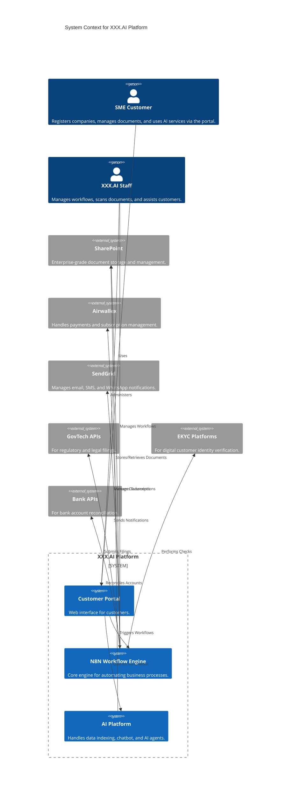

# System Architecture: XXX.AI

This document provides a comprehensive overview of the XXX.AI system architecture, including its components, technology stack, and integration points.

## 1. System Context Diagram

The following C4 diagram illustrates the high-level system context, showing users and external systems interacting with the XXX.AI platform.

## 2. Component Interactions and Dependencies

- **Customer Portal**: The primary user-facing application. It handles user authentication (US-2, US-3), presents data, and provides interfaces to trigger backend processes. It communicates with the N8N engine via REST APIs.
- **N8N Workflow Engine**: The heart of the system's automation. It executes complex workflows for company formation (US-5), approvals (US-7), notifications (US-8), and other services. It integrates with all external systems.
- **AI Platform**: A collection of services responsible for advanced features. It indexes all documents from SharePoint for self-service queries (US-14), powers the customer-facing chatbot (US-11), and runs specialized AI agents for compliance monitoring (US-12).
- **SharePoint**: Acts as the primary, secure document store. Each customer is provisioned a dedicated subsite to ensure strict data isolation. Documents are tagged and categorized, partly through OCR (US-9) and AI.

## 3. Technology Stack

- **Frontend**: Static Marketing Site (HTML/CSS/JS), Customer Portal (React or similar modern framework).
- **Backend/Automation**: N8N (Workflow Engine).
- **Document Management**: Microsoft SharePoint.
- **AI/ML**: Custom/Pre-trained LLMs (e.g., GPT), OCR libraries (e.g., Tesseract), Chatbot frameworks (e.g., Rasa, Dialogflow).
- **Database/Search**: Elasticsearch for advanced data querying (TS-12).
- **Hosting/Infrastructure**: AWS (S3 for static site).
- **Authentication**: JWT-based authentication (TS-2).
- **Integrations**:
  - **Payments**: Airwallex
  - **Notifications**: SendGrid
  - **Digital Signatures**: DocuSign or similar (for US-10)
  - **APIs**: GovTech, EKYC Platforms, Bank APIs.

## 4. Architectural Decisions (ADRs)

| ID | Decision | Rationale | Alternatives Considered |
|----|----------|-----------|-------------------------|
| ADR-01 | Use SharePoint for document management. | Provides robust security, versioning, and enterprise-grade features. Ensures data isolation per customer via subsites. | AWS S3, Google Cloud Storage |
| ADR-02 | Use N8N as the core workflow engine. | Highly flexible, extensible, and self-hostable, providing control over data and integrations. | Zapier, IFTTT, custom code |
| ADR-03 | Integrate with Airwallex for payments. | Offers a comprehensive solution for payments and tiered subscription management suitable for the target market. | Stripe, PayPal |