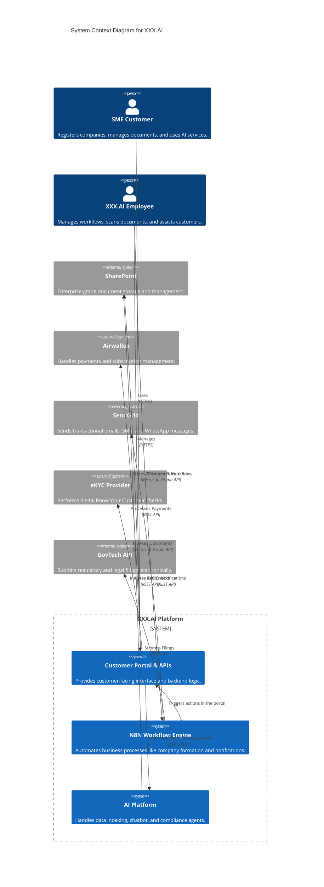

# System Architecture: XXX.AI

## 1. Overview

The XXX.AI platform is a digital-first, AI-powered corporate services provider. The architecture is designed as a microservices-oriented system that leverages best-in-class third-party services for core functionalities like document management, workflow automation, and payments. This approach allows for rapid development and scalability.

The system's core components are the Customer Portal (frontend), a set of backend services (APIs), a workflow engine (N8N), and an AI platform for advanced automation and insights.

## 2. System Context Diagram

This C4 diagram illustrates the high-level system context, showing users and external systems interacting with the XXX.AI platform.

## 3. Component Interactions & Dependencies

- **Customer Portal**: The primary user interface. It communicates with our backend APIs for all business logic.
- **Backend APIs**: A set of services responsible for authentication, user management, and orchestrating calls to external systems. It is the gatekeeper for SharePoint and other services.
- **N8N Workflow Engine**: The heart of process automation. It is triggered by events in the Customer Portal (e.g., a user starting company formation) and executes long-running processes involving multiple steps and external integrations (SendGrid, GovTech).
- **AI Platform**: Consumes data from SharePoint and the main application database. It indexes this data to power the self-service chatbot and proactive compliance agents.
- **SharePoint**: Acts as the secure document store. Each customer is provisioned a dedicated subsite to ensure strict data isolation. Access is managed exclusively through the Backend APIs.

## 4. Technology Stack

- **Frontend**: To be decided (e.g., React, Vue.js).
- **Backend**: To be decided (e.g., Node.js with Express/Fastify).
- **Workflow Automation**: **N8N**
- **Document Management**: **Microsoft SharePoint** (Primary), AWS S3 (Alternative for binary objects).
- **Payments & Subscriptions**: **Airwallex**
- **Messaging**: **SendGrid**
- **AI & Machine Learning**: To be decided (Custom LLMs vs. off-the-shelf like GPT), OCR technology for document scanning.
- **Infrastructure**: To be decided (e.g., AWS, Azure).

## 5. Integration Points

- **SharePoint API**: For creating customer subsites, uploading/downloading documents, and managing permissions.
- **Airwallex API**: For creating subscription plans, processing payments, and managing customer billing cycles.
- **SendGrid API**: For sending templated emails, SMS, and WhatsApp messages as part of N8N workflows.
- **eKYC Provider API**: For submitting customer details and receiving verification status.
- **GovTech API**: For programmatic submission of legal and regulatory filings.

## 6. Architectural Decisions (ADRs)

| ID | Decision | Rationale | Alternatives Considered |
|----|----------|-----------|-------------------------|
| ADR-001 | Use SharePoint for enterprise-grade document management. | SharePoint provides robust document management capabilities, security features (data isolation per subsite), and native integration with the Microsoft ecosystem. | AWS S3, Google Cloud Storage |
| ADR-002 | Use N8N as the workflow engine. | N8N is a flexible, self-hostable, and extensible workflow automation platform that can be easily integrated with our custom systems and external APIs. | Zapier, IFTTT, Camunda |
| ADR-003 | Integrate with Airwallex for payment and subscription management. | Airwallex provides a comprehensive payment and subscription management solution with support for the tiered subscription packages required by the business model. | Stripe, PayPal, Braintree |