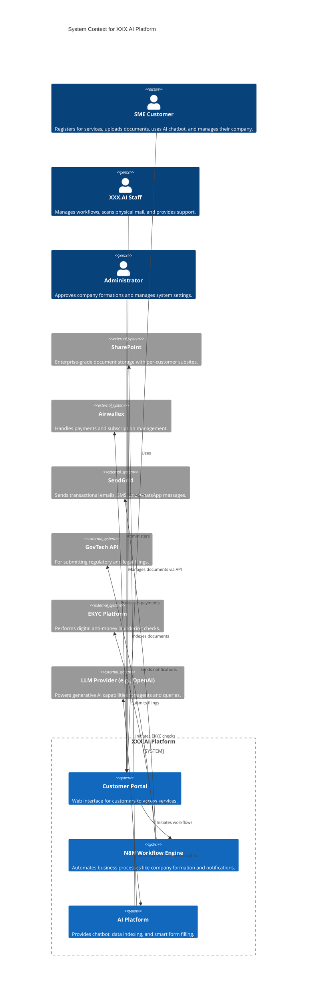

# System Architecture: XXX.AI

## 1. Overview

This document outlines the architecture for the XXX.AI platform, a digital-first corporate services provider. The system is designed to be highly automated, leveraging a workflow engine, AI capabilities, and integrations with best-in-class external services to disrupt the traditional corporate services industry.

The core of the architecture is a composable system where a central Customer Portal interacts with specialized services for workflows (N8N), document management (SharePoint), payments (Airwallex), and AI-driven insights (LLM Provider).

## 2. System Context Diagram

## 3. Component Interactions and Dependencies

- **Customer Portal**: The primary user-facing application. It handles user authentication, presents the UI, and acts as an API gateway to the backend services. It is dependent on all other components to deliver its functionality.
- **N8N Workflow Engine**: The heart of business process automation. It is triggered by events from the Customer Portal (e.g., new company formation request) and orchestrates calls to external systems like GovTech, SendGrid, and KYC platforms.
- **SharePoint**: The primary document repository. It is configured with a dedicated, isolated subsite for each customer. The Customer Portal interacts with it via the Microsoft Graph API for uploads, downloads, and search. Data is encrypted at rest.
- **AI Platform**: A collection of services responsible for OCR, data indexing, smart form filling, and powering the AI agents. It reads data from SharePoint, processes it, and interacts with an external LLM provider to generate responses and insights.

## 4. Technology Stack

- **Workflow Automation**: N8N
- **Document Management**: Microsoft SharePoint
- **Payment & Subscriptions**: Airwallex
- **Messaging**: SendGrid (Email, SMS, WhatsApp)
- **AI & Machine Learning**: External LLM Provider (e.g., OpenAI/GPT), OCR Technology
- **Integrations**: GovTech API, EKYC Platform APIs, Bank APIs
- **Frontend**: To be determined (e.g., React, Vue.js)
- **Backend**: To be determined (e.g., Node.js, Python)

## 5. Integration Points

- **Airwallex**: For processing tiered subscription payments.
- **SharePoint**: For secure, isolated document storage and management.
- **SendGrid**: For all outbound customer communications.
- **GovTech API**: For automated submission of legal and regulatory documents.
- **EKYC Platforms**: For digital customer identity verification.
- **LLM Provider**: To power the chatbot, self-service queries, and AI agents.

## 6. Architectural Decisions (ADRs)

| Decision ID | Decision | Rationale | Alternatives Considered |
| :--- | :--- | :--- | :--- |
| **ADR-001** | Use SharePoint for document management. | Provides robust, enterprise-grade capabilities, security, and existing integration paths. | AWS S3 bucket |
| **ADR-002** | Use N8N as the workflow engine. | Flexible, extensible, and easily integrated with various APIs and systems for process automation. | Other workflow automation tools |
| **ADR-003** | Integrate with Airwallex for payments. | Offers a comprehensive solution for payments and tiered subscription management. | Other payment gateways |
| **ADR-004** | Use mainstream, out-of-the-box LLMs. | Significantly reduces development time and cost compared to training custom models. | Training custom LLMs |