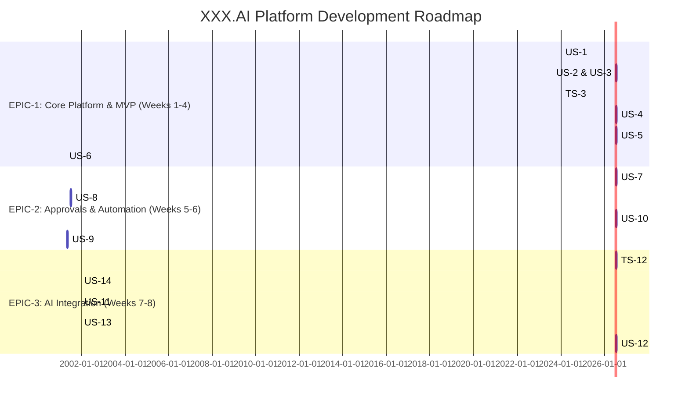

# Project Roadmap

This document outlines the project timeline, milestones, and dependencies for the development of the XXX.AI platform.

## 1. Epic Implementation Timeline

The project is planned for a duration of 8 weeks, broken down into three main epics.

## 2. Milestone Definitions

| Milestone | Epic | Target Date | Success Criteria |
|-----------|------|-------------|------------------|
| **M1: MVP Launch** | EPIC-1 | End of Week 4 | - Marketing site is live. - Customers can register, log in, and upload documents. - The core company formation workflow (US-5) is functional. |
| **M2: Enhanced Automation** | EPIC-2 | End of Week 6 | - Admin approval workflow (US-7) is operational. - Automated notifications (US-8) are sent for key events. - Secure E-approval process (US-10) is implemented. |
| **M3: AI-Powered Platform** | EPIC-3 | End of Week 8 | - AI Chatbot (US-11) is available for customer queries. - AI agents (US-12) are monitoring compliance. - Data is indexed and searchable via advanced queries (US-14). |

## 3. Dependencies

- **Epic Dependencies**: `EPIC-2` is dependent on the foundational components of `EPIC-1`. `EPIC-3` depends on the data structures and workflows established in `EPIC-1` and `EPIC-2`.
- **Story Dependencies**:
  - `US-3` (Login) depends on `US-2` (Register).
  - `US-4` (Doc Upload) depends on `US-3` (Login).
  - `US-5` (Company Formation) depends on `US-3` (Login).
  - `US-6` (Search) depends on `US-4` (Doc Upload).
  - `US-7` (Admin Approval) depends on `US-5` (Company Formation).
  - `US-9` (Scanning) depends on `US-4` (Doc Upload).

## 4. Risk Mitigation Timeline

- **Risk**: `TS-8` (E-Approval) is rated 'high' risk due to complexity and security requirements.
  - **Mitigation**: Begin technical evaluation and Proof of Concept for digital signature providers during Week 4 (end of EPIC-1) to inform implementation in Week 5.
- **Risk**: `TS-10` (AI Agents) is rated 'high' risk due to model development complexity.
  - **Mitigation**: Start data analysis and model selection research during Week 5. Develop a simplified version of one agent first to validate the architecture.
